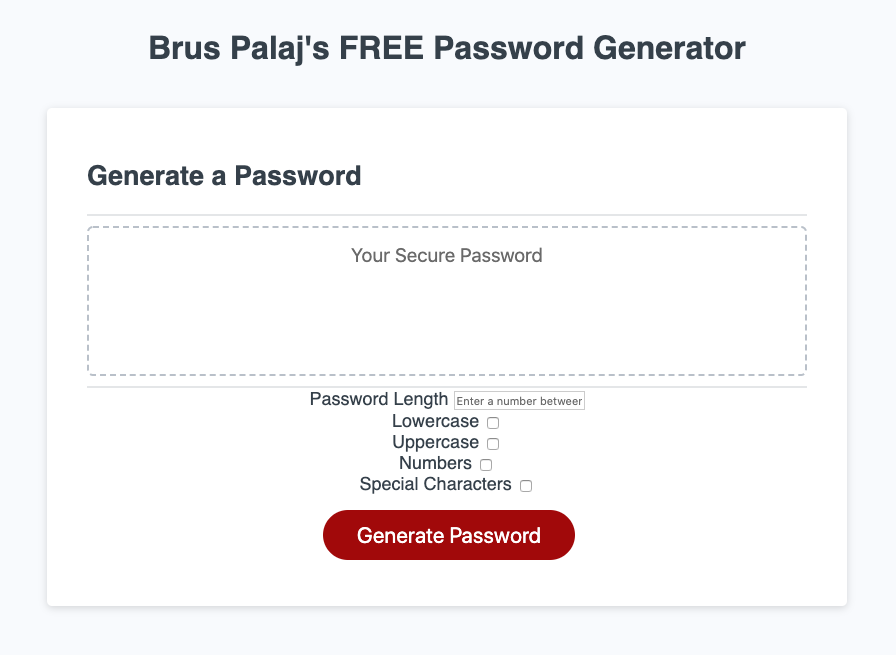

# Password Generator

https://bruspdoee.github.io/Random-Password-Generator/

<strong>Desktop</strong>
 

<strong>Mobile</strong>
 

Requirements for the Password Generator:

1. The new password that is generated has to be secure.

2. After going through a series of prompts for:

- length of at least 8 characters no more than 128 characters
- lowercase
- uppercase
- numeric
- and/or special characters

3. The input should be validated and at least one character type should be selected.

4. When all the prompts are answered, the password is generated to match the selected criteria.

# More Detailed Overview

- Started this off by creating variables for all characters that will be used to formulate "secure password" (Upper/Lower case, numbers and special characters).
- Next, I created different inputs on my HTML to specify which options should be excercised in the password and followed up by creating variables for character inputs to be changes upon selection
- Then, created an IF statement that will add each different option to my validcharacters variable if checked on the input checkbox
- Created Function that will return randomized characters (either number or strings) which is converted using the ParseInt method
- Function that takes into account how long you want it to be through amountOfChars so then it repeats choosing a random character for as long as the password is supposed to be
- Created a function that will generate a password based on IF/WHICH one of the option are checked off in the input boxes
- Function that will make a password and add to the password input with an IF statement that makes sure user enters a number between 8-128 deciding before getting a generated password
- Finally an event listener that calls the writePassword function when the generateBTN is clicked.
